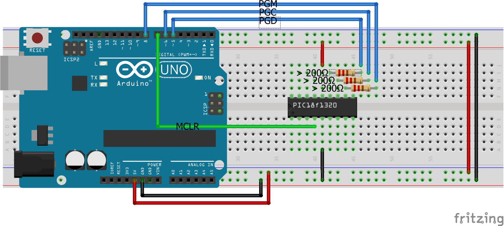
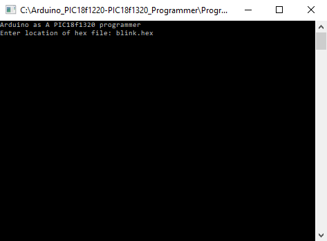

# Arduino PIC18f1220/1320  Programmer

This project contains a Arduino based programmer for the PICf1320. For this purpose a Windows application that communicates with the Arduino application is included in this repository. The code is based on a similar project for another micro controller from the PIC family from [here](https://sites.google.com/site/thehighspark/arduino-pic18f).

## Usage

1. Build the Windows application with CMake
2. Upload the sketch in Programmer_Arduino to the Arduino
3. Connect the Arduino to the PIC

4. Load hex file with Windows application and program the PIC
